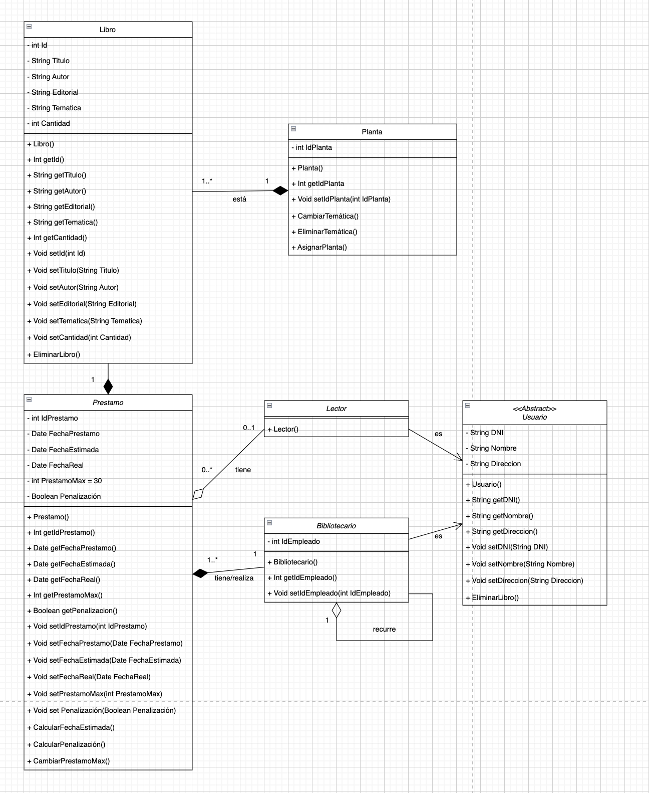

# LA BIBLIOTECA MUNICIPAL

## Enunciado

Se desea modelar el funcionamiento de una biblioteca municipal, teniedo en cuenta que:

Los libros se organizan según la temática: libros infantiles, narrativa, ensayo, poesía, etc. Sabemos que cada temática se encuentra alojada en una planta de la biblioteca. Además, se deben registrar los libros que se encuentran en la biblioteca. Cada libro contará con un identificador. Utulo, autor. editorial; por cada libro puede haber más de un ejemplar disponible para préstamo. Por cada préstamo deberá almacenarse el ejemplar, la fecha de préstamo, la fecha de entrega estimada y la real. El préstamo máximo será de 30 días. Los lectores que no entreguen el libro a tiempo tendrán penalización. Para aplicar esa penalización, la biblioteca cuenta con una ficha por cada lector, con su número de identificación o pasaporte, su nombre y su dirección postal. Para fomentar la lectura, los empleados de la biblioteca, que poseen su propia Identificación como tales, pueden llevar libros a casa por un plazo mayor que los usuarios convencionales. También es importante que el préstamo del libréo se realiza mediante un bibliotecario

En todo momento, debes indicar getters, setters y no es recomendable dejar ninguna clase sin métodos.

Crea el diagrama de clases correspondiente.

## Diagrama UML

- Las clases "Lector" y "Bibliotecario" heredan de la clase "Usuario" sus atributos, ya que tanto uno como el otro tienen datos comunes.

- La clase "Bibliotecario" recurre a sí misma debido a que un bibliotecario necesita de otro para realizar un préstamo.

- La clase "Libro" tiene una temática, lo cual sirve para ubicar el libro en su planta correspondiente.

- Tanto el método "CalcularPenalización()" como "CambiarPrestamoMax()" necesitan saber si la persona a la que se le realiza el préstamo es un bibliotecario o un lector.
